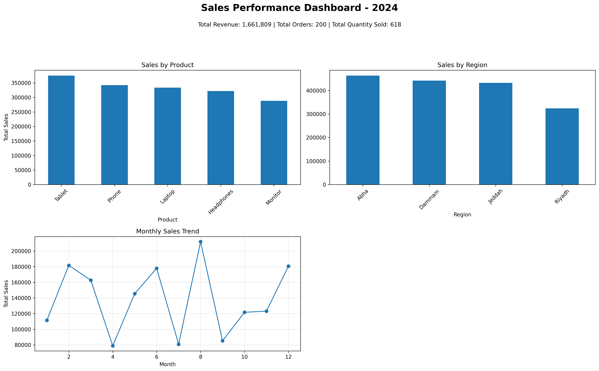

# 📊 Sales Performance Analysis

## 📌 Project Overview
This project analyzes sales performance using Python (Pandas & Matplotlib).  
The objective is to explore revenue trends, product performance, regional sales distribution, and seasonality patterns.

The analysis focuses on identifying key revenue drivers and business insights that can support data-driven decision-making.

---

## 🛠 Tools & Technologies
- Python
- Pandas
- Matplotlib

---

## 📂 Dataset Information
The dataset includes the following fields:

- Order_ID
- Order_Date
- Customer_Name
- Region
- Product
- Quantity
- Unit_Price
- Total_Sales

**Note:**  
The dataset does not include product cost information. Therefore, the analysis focuses on revenue performance rather than profitability.

---

## 📈 Key Insights

- 💻 **Laptop** is the highest revenue-generating product.
- 🌍 **Riyadh** shows the strongest regional sales performance.
- 📅 Sales peak during specific months, indicating clear seasonality.
- 📦 Some products sell higher quantities but generate lower revenue due to pricing differences.
- 🏬 Certain regions rely heavily on specific products.

---

## 📊 Dashboard Overview

The dashboard includes:

- Total Sales by Product (Bar Chart)
- Total Sales by Region (Bar Chart)
- Monthly Sales Trend (Line Chart)

### Dashboard Preview



---

## 🚀 How to Run the Project

1. Clone the repository

2. Install required libraries:
```
pip install pandas matplotlib
```

3. Run the script:
```
python sales_analysis.py
```
---

## 📌 Project Structure

```
sales-analysis/
│
├── sample_sales_data.csv
├── sales_analysis.py
├── dashboard.png
└── README.md
```

---

## 📎 Conclusion

This project demonstrates fundamental data analysis skills including:

- Data cleaning
- Exploratory Data Analysis (EDA)
- GroupBy and Pivot Tables
- Data visualization using Matplotlib
- Extracting business insights from sales data

The project can be further enhanced by adding:
- Profitability analysis (if cost data is available)
- Interactive dashboards (Plotly / Streamlit)
- Advanced KPIs and forecasting

---

👨‍💻 Built as part of a Data Analysis learning project.
